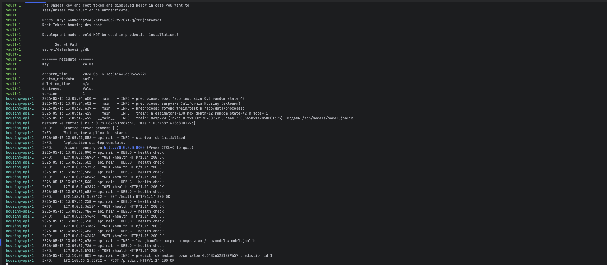
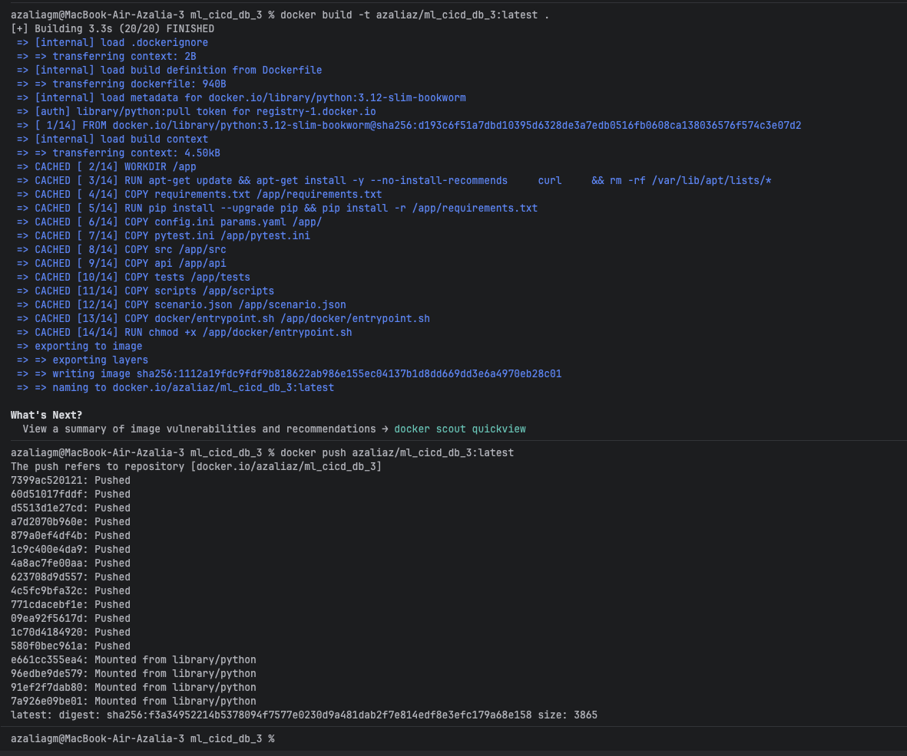
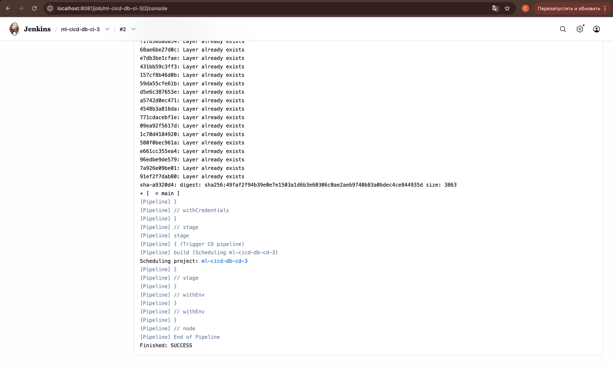
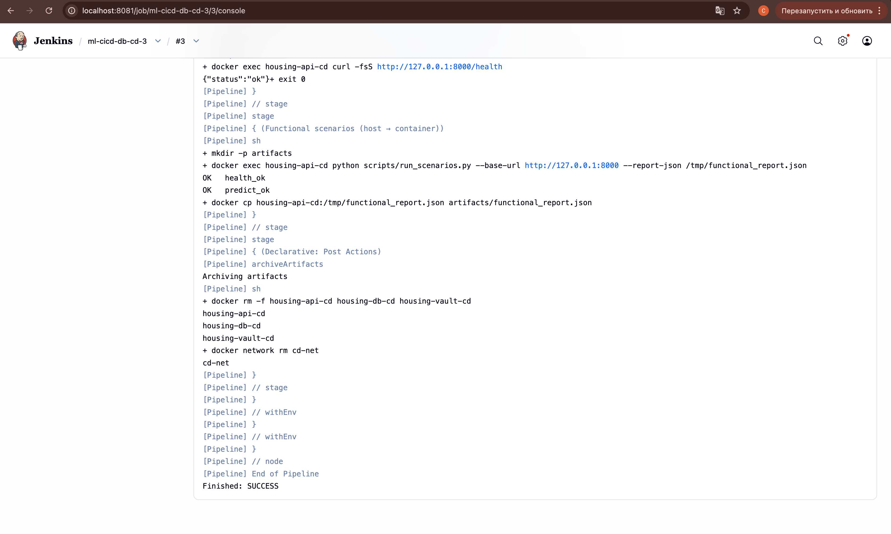

# Лабораторная работа №3

Отчёт по интеграции хранилища секретов, CI/CD и Docker Hub для проекта **ml_cicd_db_3**.

---

## 1) Хранилище секретов

- В стек добавлен **третий сервис** — контейнер **Vault** (`docker-compose.yml`, сервис `vault`).
- Образ хранилища собирается из **`Dockerfile.vault`**: на этапе сборки в образ копируется скрипт **`docker/vault/entrypoint-vault.sh`** (инициализация логики KV при старте контейнера).
- При запуске контейнера Vault поднимается в режиме **dev** (только для разработки и демонстрации), в движок **KV v2** записывается путь **`secret/housing/db`** с полями: `username`, `password`, `dbname`, `host`, `port`. Значения передаются переменными **`VAULT_SEED_DB_*`** из окружения compose, а не хранятся в репозитории как готовый файл с паролями приложения.


## 2) Взаимодействие приложения с секретами и БД

**Что сделано**

- Секреты для подключения к PostgreSQL **размещены в Vault** (см. раздел **1)**).
- В **`src/db.py`**: при заданных **`VAULT_ADDR`** и **`VAULT_TOKEN`** параметры подключения читаются из Vault по **HTTP API** (KV v2, путь по умолчанию `secret/data/housing/db`). Для локальных тестов без Vault сохранён fallback на **`DB_*`** / **`DATABASE_URL`**.
- В **`docker-compose.yml`** у сервиса **`housing-api`** в окружение **не** передаются `DB_USER` / `DB_PASSWORD` — только переменные Vault и путь к секрету.
- Файл **`.env`** с реальными паролями для Postgres и сидирования Vault **не коммитится** (см. **`.gitignore`**); в репозитории есть шаблон **`.env.example`** без секретов.

**Проверка**

1. Заполнить **`.env`** по **`.env.example`**, поднять полный стек:
   ```bash
   docker compose up --build
   ```



## 3) Docker и Docker Hub

**Что сделано**

- Образ приложения описан в **`Dockerfile`**; локально вместе с Vault и Postgres поднимается **`docker compose`**.
- Публикация образа в **Docker Hub**: через **CI (Jenkins)** после успешных тестов (раздел **4)**) и/или вручную командами ниже.


**Ручной push на Docker Hub**

```bash
docker login
docker build -t azaliaz/ml_cicd_db_3:latest .
docker push azaliaz/ml_cicd_db_3:latest
```



## 4) CI (Jenkins): сборка, тесты, публикация в Docker Hub

### Что реализовано

- В проекте настроен CI через **`CI/Jenkinsfile`**.
- При запуске CI:
  1. забирается код из Git (репозиторий с `Dockerfile` и исходниками);
  2. собирается Docker-образ приложения (`docker build` в корне проекта);
  3. запускаются тесты **`pytest`** внутри временного контейнера из этого образа;
  4. для веток **`main`** и **`develop`** образ **отправляется в Docker Hub** (`docker login` / `docker push`): публикуются теги **`<номер_сборки>`** и **`sha-<короткий_хеш_коммита>`** (базовое имя образа задаётся параметром **`DOCKER_IMAGE_BASENAME`**, например **`azaliaz/ml_cicd_db_3`**).
- Для ветки **`main`** дополнительно обновляется тег **`latest`** (последняя актуальная версия образа на Hub).
- После успешного push при включённом параметре **`TRIGGER_CD`** может быть поставлен в очередь запуск **CD** с тем же собранным образом (CI не ждёт его завершения).



В результате CI образ приложения оказывается в **Docker Hub** (репозиторий задаётся параметром **`DOCKER_IMAGE_BASENAME`**, в примере — **`azaliaz/ml_cicd_db_3`**): обычно видны два тега — по номеру сборки Jenkins и **`sha-…`** по коммиту; для ветки **`main`** дополнительно обновляется **`latest`**.


## 5) CD (Jenkins): развёртывание и функциональное тестирование

### Что реализовано

- В проекте настроен CD через **`CD/Jenkinsfile`**.
- При запуске CD:
  1. забирается код из Git (на агенте нужны **`Dockerfile.vault`**, **`scenario.json`**, **`scripts/run_scenarios.py`** и остальные файлы из репозитория);
  2. с **Docker Hub** скачивается образ приложения, указанный параметром **`DOCKER_IMAGE`** (например **`azaliaz/ml_cicd_db_3:2`** или **`:latest`**);
  3. собирается образ **хранилища секретов** **`housing-vault:cd`** из **`Dockerfile.vault`**;
  4. при включённом параметре **`RUN_PYTEST_IN_CONTAINER`** ещё раз запускаются тесты **`pytest`** внутри контейнера из образа с Hub;
  5. при включённом **`RUN_SCENARIOS`** в сети **`cd-net`** поднимаются **PostgreSQL** (логин/пароль из Jenkins credentials **`postgres-app-user`**), **Vault** (те же учётные данные записываются в KV) и контейнер **API** с образа Hub; в API передаются только **`VAULT_ADDR`**, **`VAULT_TOKEN`**, **`VAULT_SECRET_PATH`** — пароль БД в env API не пробрасывается;
  6. в цикле вызывается **`GET /health`** по **`http://127.0.0.1:8000`** **внутри** контейнера API (первые попытки часто падают, пока в **`docker/entrypoint.sh`** идут **preprocess** и **train**, затем поднимается uvicorn);
  7. выполняется **`scripts/run_scenarios.py`** по **`scenario.json`**, отчёт пишется в **`artifacts/functional_report.json`** и сохраняется как артефакт сборки; в **`post`** контейнеры и сеть удаляются.





В результате выполнения CD-пайплайна проверяется образ с **Docker Hub**, пройдены функциональные сценарии; в артефактах сборки доступен файл **`functional_report.json`** для отчёта.


