# Лабораторная №2

## 1) Интеграция FastAPI-сервиса модели с PostgreSQL
- В проекте реализована интеграция FastAPI-сервиса модели с PostgreSQL.
- После каждого запроса `POST /predict` результат инференса сохраняется в таблицу `predictions`.
- В таблицу записываются:
  - входные признаки (`features_json`),
  - значение предсказания (`prediction_value`),
  - версия модели (`model_version`),
  - статус выполнения (`status`),
  - время записи (`created_at`).

## 2) Реализованы аутентификация/авторизация сервиса при обращении к БД

- Подключение к PostgreSQL выполняется через параметры окружения:
  - `DB_HOST`, `DB_PORT`, `DB_NAME`, `DB_USER`, `DB_PASSWORD`
  - либо через `DATABASE_URL`.
- В исходном коде не используются явно прописанные логины/пароли, адреса/порты или токены доступа.
- Для локального запуска используется `.env` (по шаблону `.env.example`), для Jenkins/CD — credentials (`postgres-app-user`).
## 43) Работа с Docker и DockerHub
### Что реализовано
- Подготовлен `Dockerfile` для сборки контейнера ML-сервиса.
- Настроен `docker-compose.yml` для запуска связки:
  - `housing-api` (FastAPI-сервис модели),
  - `postgres` (БД для сохранения результатов инференса и загрузки train/val).
- Контейнер API при старте выполняет:
  1. preprocessing,
  2. обучение модели,
  3. запуск REST API на `8000`.

### Локальная проверка Docker
Сборка и запуск:
```bash
docker compose up --build
```
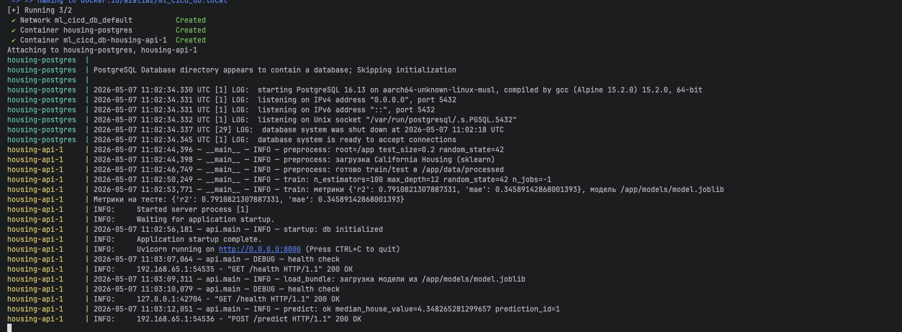

## Публикация образа в DockerHub
```
docker login
docker build -t azaliaz/ml_cicd_db:manual-test .
docker push azaliaz/ml_cicd_db:manual-test
```
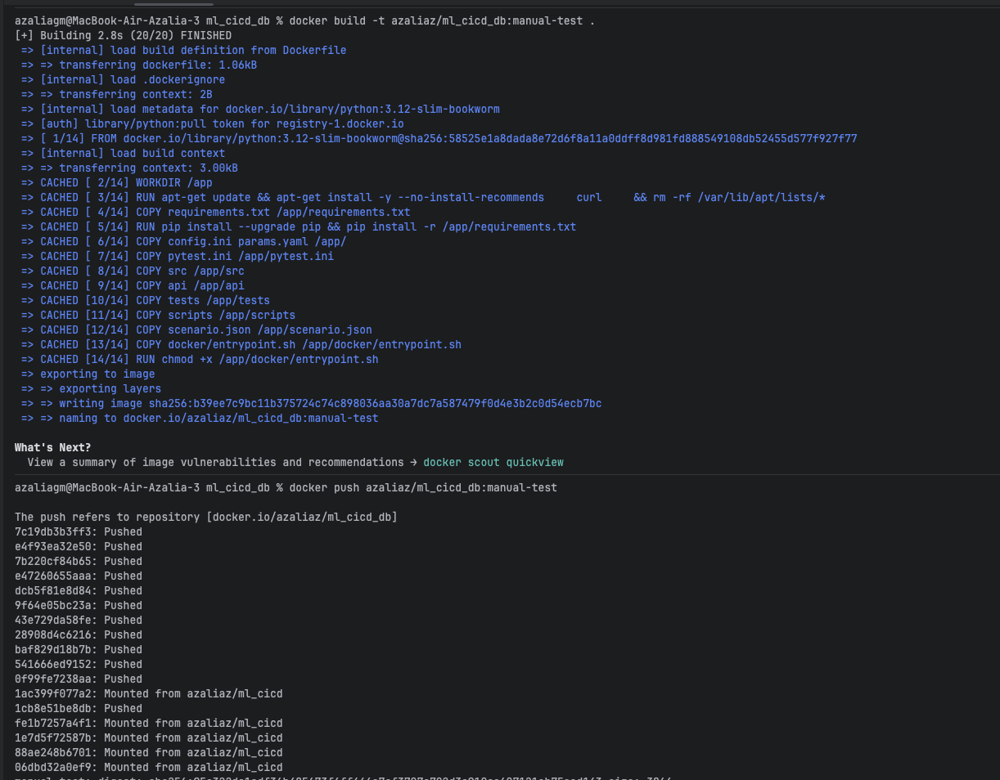
Образ успешно собран и опубликован в DockerHub (azaliaz/ml_cicd_db).
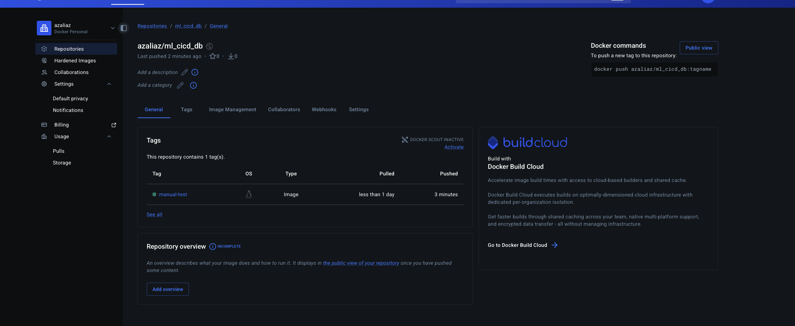
## 4) Проверка интеграции с PostgreSQL
### Что реализовано

- Сервис API сохраняет результат каждого `POST /predict` в таблицу `predictions`.
- Доступ к БД настроен через переменные окружения (`DB_HOST`, `DB_PORT`, `DB_NAME`, `DB_USER`, `DB_PASSWORD`) без hardcode секретов в коде.
- Добавлен скрипт загрузки наборов в БД: `scripts/load_dataset_to_db.py`:
  - `--split train` -> таблица `train_samples`
  - `--split val` -> таблица `val_samples`


### Команды проверки

Загрузка train/val в БД:

```bash
docker compose exec housing-api python scripts/load_dataset_to_db.py --split train
docker compose exec housing-api python scripts/load_dataset_to_db.py --split val
```
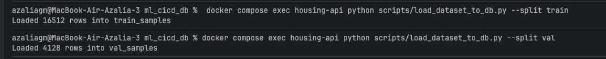
Выполнена загрузка подготовленных датасетов в PostgreSQL из контейнера housing-api: --split train записывает данные в train_samples, --split val — в val_samples.

Проверка количества строк:
```bash
docker compose exec postgres psql -U housing_app -d housing -c "SELECT COUNT(*) AS train_count FROM train_samples;"
docker compose exec postgres psql -U housing_app -d housing -c "SELECT COUNT(*) AS val_count FROM val_samples;"
```
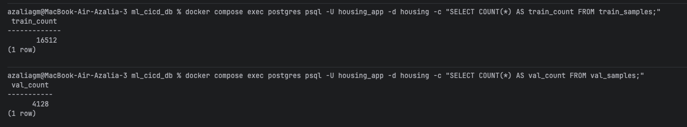

Проверка сохранения предсказаний:

```bash
docker compose exec postgres psql -U housing_app -d housing -c "SELECT id, created_at, prediction_value, model_version, status FROM predictions ORDER BY id DESC LIMIT 5;"
```

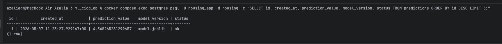

Интеграция сервиса модели с PostgreSQL работает корректно:
- API успешно пишет результаты инференса в БД (predictions).
- Наборы train/val успешно загружаются в БД (train_samples, val_samples).
- Конфигурация подключения и учетные данные передаются через переменные окружения, без хранения секретов в исходном коде.

## 5) CI (Jenkins): сборка, тесты, публикация в DockerHub

### Что реализовано

- В проекте настроен CI через `CI/Jenkinsfile`.
- При запуске CI:
  1. забирается код из GitHub;
  2. собирается Docker-образ;
  3. запускаются тесты `pytest` внутри контейнера;
  4. образ отправляется в DockerHub.
- Для ветки `main` дополнительно обновляется тег `latest` (последняя актуальная версия образа).

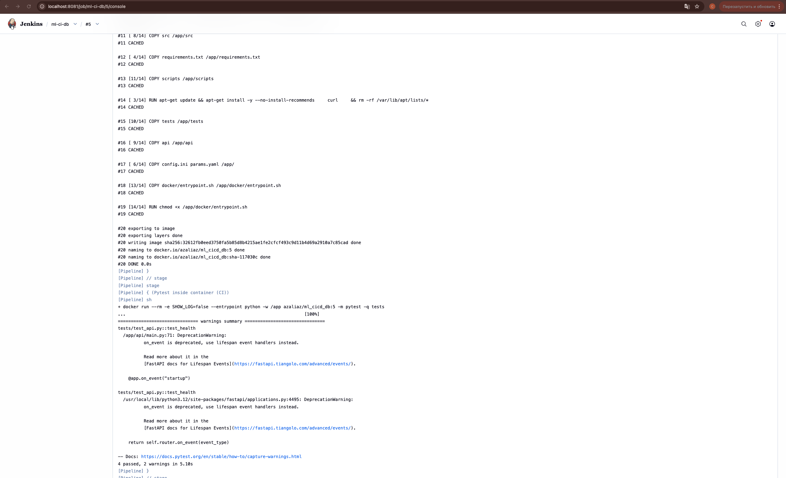
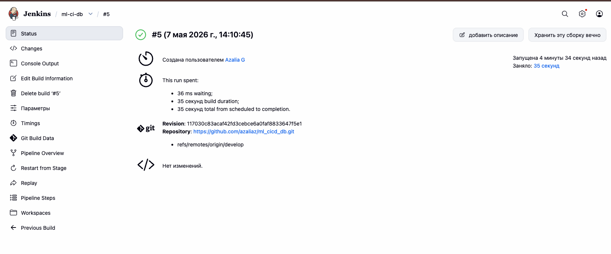
В результате выполнения CI-пайплайна образ приложения был успешно опубликован в DockerHub (azaliaz/ml_cicd_db).
После сборки были созданы два тега:

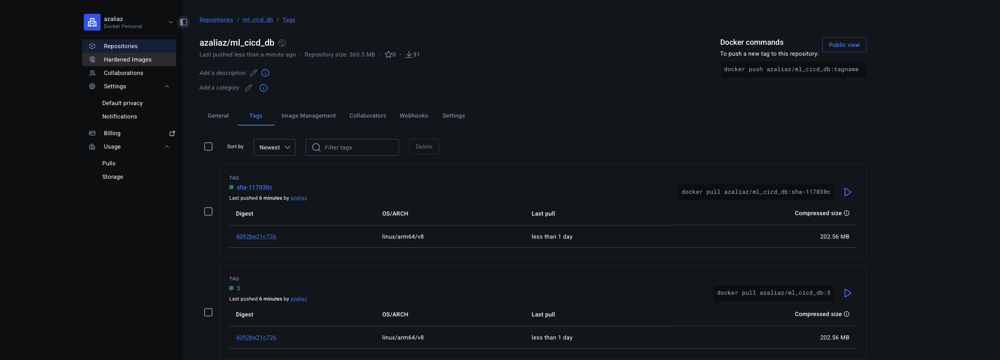

5 — тег по номеру сборки Jenkins;
sha-117030c — тег по короткому хэшу коммита.
Оба тега имеют одинаковый digest (sha256:4092be21c726...), что подтверждает: они указывают на один и тот же Docker-образ (один и тот же артефакт, опубликованный под разными тегами).
Это означает, что CI корректно выполняет сборку, тестирование и публикацию образа в DockerHub.

## 6) CD (Jenkins): развертывание и функциональное тестирование

### Что реализовано

- В проекте настроен CD через `CD/Jenkinsfile`.
- При запуске CD:
  1. выполняется `docker pull` образа из DockerHub;
  2. поднимаются контейнеры PostgreSQL и API;
  3. выполняется проверка готовности сервиса через `/health`;
  4. запускаются функциональные сценарии из `scenario.json`;
  5. результаты сохраняются в артефакт Jenkins `artifacts/functional_report.json`.


### Результат проверки

- Контейнеры `housing-db-cd` и `housing-api-cd` успешно запущены.
- Health-check прошел успешно (`{"status":"ok"}`).
- Функциональные сценарии выполнены успешно:
  - `OK health_ok`
  - `OK predict_ok`
- Build CD завершился статусом `SUCCESS`.
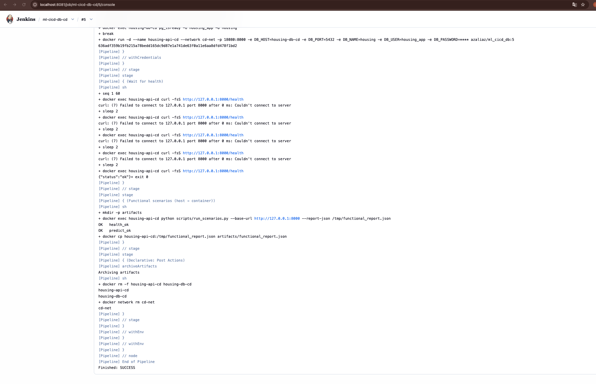
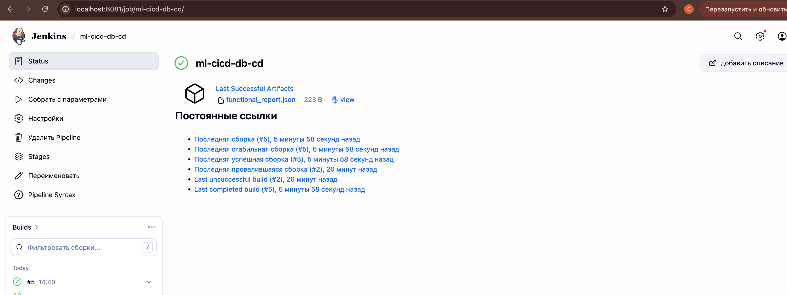

Артефакт artifacts/functional_report.json с результатами функционального тестирования CD-пайплайна.
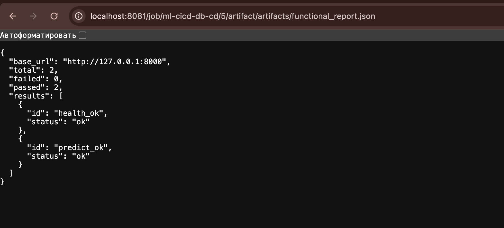

CD pipeline корректно выполняет развертывание сервиса из DockerHub-образа и подтверждает работоспособность API автоматическим функциональным тестированием с сохранением отчета в артефакты Jenkins.

